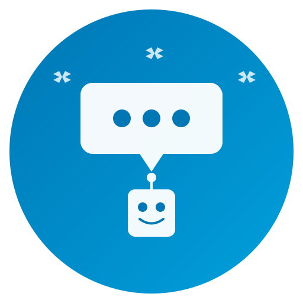

# LinkedIn Comment Responder - Logo Assets

This directory contains logo assets for the LinkedIn Comment Responder project.

## Available Logos

### 1. `logo.svg` - Detailed Logo
- **Size**: 200x200px
- **Use**: Documentation, presentations, large displays
- **Features**: 
  - LinkedIn blue color scheme (#0077B5)
  - Chat bubble with AI indicators
  - Robot icon showing automation
  - Circular automation flow
  - Text label

### 2. `logo-simple.svg` - App Icon / Social Media
- **Size**: 512x512px
- **Use**: App icons, social media profiles, GitHub repository
- **Features**:
  - Gradient background (LinkedIn blue)
  - Clean chat bubble with typing dots
  - Friendly robot character
  - Sparkle effects for AI/automation
  - High resolution for scaling

### 3. `favicon.svg` - Website Favicon
- **Size**: 32x32px
- **Use**: Browser tabs, bookmarks
- **Features**:
  - Minimal design for small sizes
  - LinkedIn blue background
  - Simple chat bubble with dots
  - Optimized for 16x16 and 32x32 display

## Usage

### In HTML
```html
<!-- Favicon -->
<link rel="icon" type="image/svg+xml" href="favicon.svg">

<!-- Logo in page -->

```

### In README.md
```markdown

```

### As GitHub Repository Social Preview
1. Go to repository Settings
2. Scroll to "Social preview"
3. Upload `logo-simple.svg` (or convert to PNG)
4. Recommended size: 1280x640px

## Color Palette

- **Primary**: #0077B5 (LinkedIn Blue)
- **Secondary**: #00A0DC (Light Blue)
- **Accent**: White (#FFFFFF)
- **Background**: Gradient from #0077B5 to #00A0DC

## Design Elements

### Chat Bubble
Represents LinkedIn comments and conversations that the bot responds to.

### Robot Icon
Symbolizes AI-powered automation and intelligent response generation.

### Typing Dots
Indicates active comment processing and response generation.

### Sparkles
Represent AI magic and automated workflow.

### Circular Flow
Shows the continuous automation cycle: monitor → analyze → respond.

## Converting to PNG

If you need PNG versions for certain platforms:

```bash
# Using ImageMagick
convert logo-simple.svg -resize 512x512 logo-512.png
convert logo-simple.svg -resize 256x256 logo-256.png
convert logo-simple.svg -resize 128x128 logo-128.png

# Using Inkscape
inkscape logo-simple.svg --export-png=logo-512.png --export-width=512
```

## License

These logos are part of the LinkedIn Comment Responder project and follow the same license as the main project.

## Credits

- Designed for the LinkedIn Comment Responder project
- Created as part of agent-driven development workflow
- Inspired by LinkedIn's brand colors and design language
